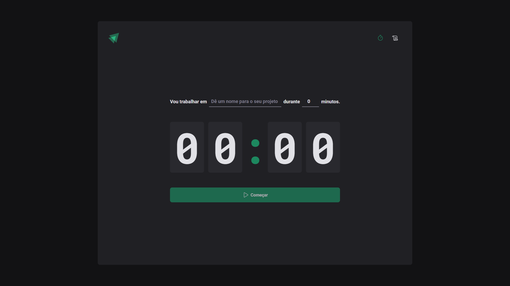

<div align="center">
  

  <h3 align="center">ignite-timer</h3>

  <p align="center">
    A front-end timer project with an awesome interface
  </p>
  <p align="center">
    ENG •
    <a href="./README.ptbr.md">
      PT-BR
    </a>
  </p>
</div>

## About the Project
Ignite Timer is a project developed in [Rocketseat](https://github.com/rocketseat-education/)'s React.js specialization course. It's a Single Page Application using very important React concepts and frameworks.

## Techs
* Typescript
* styled-components
* ESLint
* React Rouder DOM
* React Hook Form
* zod
* [immer](https://immerjs.github.io/immer/)

## Knowledges
* Pages and Routing
* Components
* Context API
* Controlled vs Uncontrolled forms
* Prop Drilling
* useEffect
* Reducers

## Screenshots



### Prerequisites
* npm
```
npm install npm@latest -g
```
### Installation
1. Clone the repo
```
git clone https://github.com/gabrielturri/ignite-timer.git
```
2. Install NPM packages
```
npm install
```
3. Run and open on your browser
```
npm run dev
```