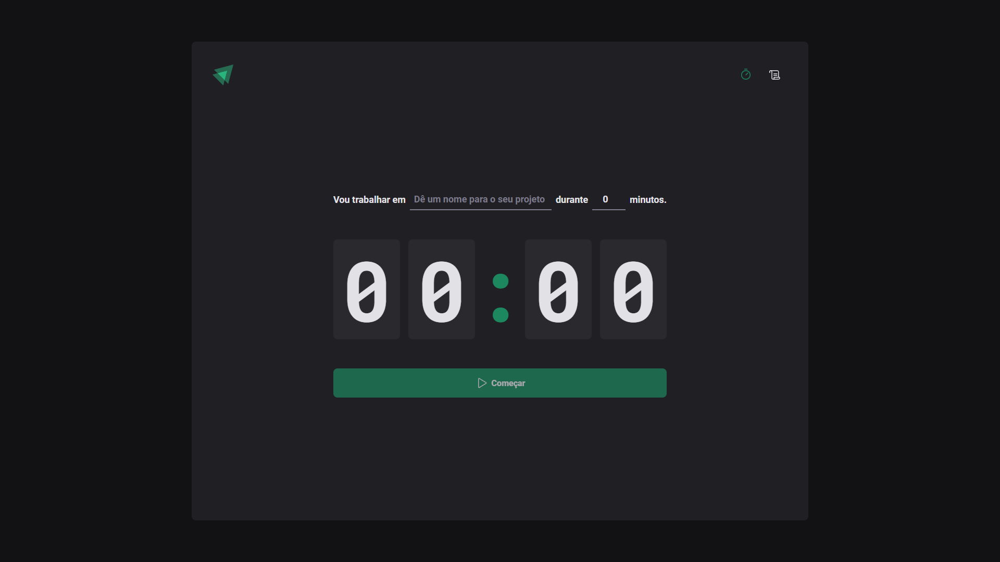
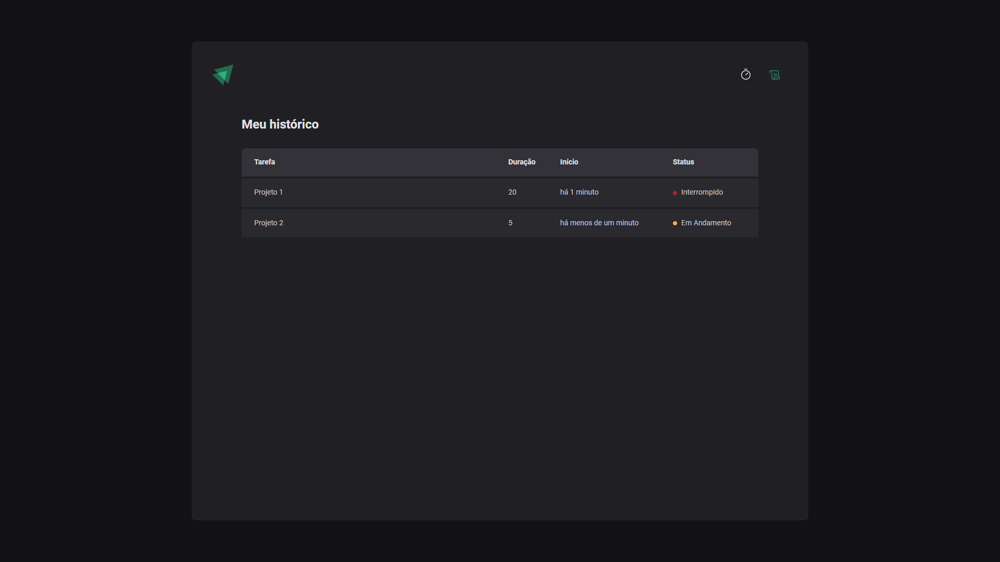

<div align="center">
  

  <h3 align="center">ignite-timer</h3>

  <p align="center">
    Um projeto front-end de temporizador
  </p>
  <p align="center">
    <a href="./README.md">
      ENG 
    </a>
    • PT-BR
  </p>
</div>

## About the Project
Ignite Timer é um projeto desenvolvido durante o Ignite, trilha do curso de especialização de React da [Rocketseat](https://github.com/rocketseat-education/), com foco em se apronfundar em alguns conceitos do ReactJS e de ferramentas do Front-end, como contexto e reducers, rotas, entre outras funcionalidades.

## Ferramentas e frameworks utilizados
* Typescript
* styled-components
* ESLint
* React Rouder DOM
* React Hook Form
* zod
* [immer](https://immerjs.github.io/immer/)

## Conhecimentos Aplicados
* Páginas e Rotas
* Componentização
* Context API
* Formulários Controlled vs Uncontrolled
* Prop Drilling
* useEffect
* Reducers

## Screenshots




### Pré-requisitos
* npm
```
npm install npm@latest -g
```
### Instalação
1. Clone o repositório
```
git clone https://github.com/gabrielturri/ignite-timer.git
```
2. Instalando pacotes NPM
```
npm install
```
3. Rode e abra no seu navegador
```
npm run dev
```